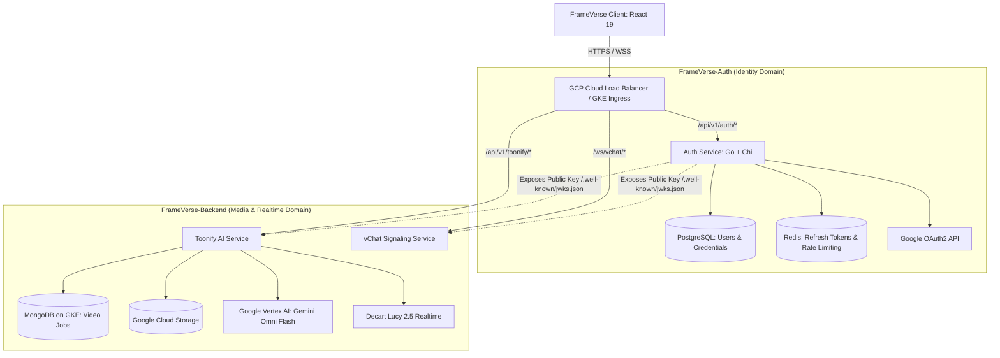
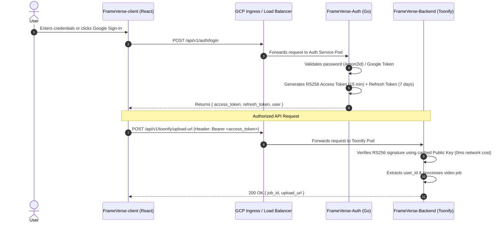

# FrameVerse-Auth — Identity & Access Management Service

**FrameVerse-Auth** is the dedicated, centralized authentication and user management microservice for the **FrameVerse** platform. It manages user identities, credential verification, OAuth2 social login, session lifecycles, and cryptographic token issuance (RS256 JWTs) for downstream services.

---

## 1. System Architecture & Topology



---

## 2. Core Responsibilities & Features

### 1. Identity & Credential Management
- **Registration & Login:** Email + Password authentication with industry-standard password hashing using **Argon2id** (or `bcrypt` with cost factor 12).
- **Google OAuth2 Sign-In:** One-click OAuth verification exchanging Google ID tokens for FrameVerse user sessions.
- **Email Verification & Password Reset:** Secure, expiring token-based email confirmation workflows.

### 2. Cryptographic Token Issuance (RS256 Asymmetric JWT)
- **Asymmetric Signing:** The Auth Service signs Access Tokens using a **Private RSA Key** (`private_key.pem`).
- **Zero-Latency Verification for Downstream Services:** Downstream microservices (`FrameVerse-Backend`, `vChat`) verify incoming requests locally using the **Public RSA Key** without querying the Auth Service or the User Database.
- **JWKS Endpoint:** Exposes `GET /.well-known/jwks.json` for automated public key distribution and seamless key rotation.

### 3. Dual-Token Session Lifecycle
- **Short-Lived Access Tokens (15 Minutes):** Fast, stateless authorization passed in `Authorization: Bearer <token>`.
- **Rotating Refresh Tokens (7 Days):** Stored as cryptographically hashed entries in Redis/Postgres. On each refresh, the previous refresh token is invalidated, preventing replay and theft attacks.
- **Revocation & Instant Logout:** Blacklists refresh tokens on logout or password change.

### 4. User Quotas & Tier Management
- Tracks user credits for AI video transformations (e.g., Gemini Omni Flash renders and Decart Lucy live minutes).
- Enforces user-tier rate limits before granting access tokens or session authorizations.

---

## 3. Database Design & Persistence

FrameVerse utilizes **Polyglot Persistence**: **PostgreSQL** is used for strict relational integrity and ACID compliance for user accounts, while **Redis** handles ephemeral session caching and rate limiting.

### PostgreSQL Schema Design

```sql
-- Users Table
CREATE TABLE users (
    id UUID PRIMARY KEY DEFAULT gen_random_uuid(),
    email VARCHAR(255) UNIQUE NOT NULL,
    password_hash VARCHAR(255),          -- NULL for pure OAuth users
    full_name VARCHAR(100) NOT NULL,
    avatar_url TEXT,
    auth_provider VARCHAR(50) DEFAULT 'local', -- 'local', 'google'
    provider_id VARCHAR(255),
    is_verified BOOLEAN DEFAULT FALSE,
    tier VARCHAR(50) DEFAULT 'free',           -- 'free', 'pro', 'enterprise'
    credits INT DEFAULT 10,                    -- AI generation credits
    created_at TIMESTAMP WITH TIME ZONE DEFAULT NOW(),
    updated_at TIMESTAMP WITH TIME ZONE DEFAULT NOW()
);

-- Refresh Tokens Table (with rotation tracking)
CREATE TABLE refresh_tokens (
    id UUID PRIMARY KEY DEFAULT gen_random_uuid(),
    user_id UUID REFERENCES users(id) ON DELETE CASCADE,
    token_hash VARCHAR(255) NOT NULL,
    user_agent TEXT,
    ip_address VARCHAR(45),
    is_revoked BOOLEAN DEFAULT FALSE,
    expires_at TIMESTAMP WITH TIME ZONE NOT NULL,
    created_at TIMESTAMP WITH TIME ZONE DEFAULT NOW()
);

-- User Quota & Activity Audit Table
CREATE TABLE user_audit_logs (
    id UUID PRIMARY KEY DEFAULT gen_random_uuid(),
    user_id UUID REFERENCES users(id) ON DELETE CASCADE,
    action VARCHAR(100) NOT NULL,              -- 'login', 'password_reset', 'credit_consumed'
    details JSONB,
    created_at TIMESTAMP WITH TIME ZONE DEFAULT NOW()
);
```

### Redis Roles
1. **Token Invalidation / Blacklist:** Tracks revoked access tokens until their natural 15-minute expiration.
2. **Distributed Rate Limiting:** Leaky-bucket / Sliding-window rate limiting per IP and per user ID (e.g., max 5 login attempts per minute).

---

## 4. End-to-End Authentication Flow



---

## 5. API Gateway & Routing Configuration

The GCP Cloud Load Balancer / GKE Ingress is configured to route traffic based on URL paths:

| Path Prefix | Target Microservice | Protocol | Security Policy |
|---|---|---|---|
| `/api/v1/auth/*` | `FrameVerse-Auth` | HTTP/REST | Public + Edge Rate Limiting |
| `/.well-known/jwks.json` | `FrameVerse-Auth` | HTTP/REST | Public + CDN Cache (1 hour) |
| `/api/v1/toonify/*` | `FrameVerse-Backend` | HTTP/REST | Protected (Requires Valid JWT) |
| `/ws/vchat/*` | `FrameVerse-Backend` | WebSockets / WSS | Protected + WebRTC Signaling |

---

## 6. REST API Reference

### Authentication Endpoints

#### `POST /api/v1/auth/register`
- **Request Body:**
  ```json
  {
    "email": "user@example.com",
    "password": "SecurePassword123!",
    "full_name": "Jane Doe"
  }
  ```
- **Response (201 Created):**
  ```json
  {
    "user": {
      "id": "c8b1a8d0-...",
      "email": "user@example.com",
      "full_name": "Jane Doe",
      "tier": "free",
      "credits": 10
    },
    "tokens": {
      "access_token": "eyJhbGciOiJSUzI1NiIs...",
      "refresh_token": "d8f3e2...",
      "expires_in": 900
    }
  }
  ```

#### `POST /api/v1/auth/login`
- **Request Body:**
  ```json
  {
    "email": "user@example.com",
    "password": "SecurePassword123!"
  }
  ```
- **Response (200 OK):** Returns user profile and newly issued token pair.

#### `POST /api/v1/auth/google`
- **Request Body:**
  ```json
  {
    "id_token": "google_oauth_id_token_here"
  }
  ```
- **Response (200 OK):** Verifies token with Google, creates user if new, and returns tokens.

#### `POST /api/v1/auth/refresh`
- **Request Body:**
  ```json
  {
    "refresh_token": "d8f3e2..."
  }
  ```
- **Response (200 OK):** Rotates refresh token and returns a new Access Token.

#### `POST /api/v1/auth/logout`
- **Headers:** `Authorization: Bearer <access_token>`
- **Request Body:** `{"refresh_token": "d8f3e2..."}`
- **Response (200 OK):** Revokes refresh token and blacklists session.

#### `GET /api/v1/auth/me`
- **Headers:** `Authorization: Bearer <access_token>`
- **Response (200 OK):** Returns current authenticated user profile, tier, and remaining AI credits.

#### `GET /.well-known/jwks.json`
- **Response (200 OK):** Public JWKS JSON containing the RSA public key for downstream token verification.

---

## 7. Recommended Project Structure

```
FrameVerse-Auth/
├── cmd/
│   └── main.go                  # Server entrypoint & graceful shutdown
├── config/
│   └── config.go                # Environment & secret loader
├── internal/
│   ├── auth/
│   │   ├── controller.go        # HTTP endpoints & request binding
│   │   ├── service.go           # Business logic, password hashing, token issue
│   │   ├── dao.go               # PostgreSQL database queries
│   │   └── models.go            # User & token data structures
│   ├── oauth/
│   │   └── google.go            # Google OAuth2 client & token validator
│   └── middleware/
│       ├── auth_guard.go        # JWT validation middleware
│       └── rate_limiter.go      # Redis-backed rate limiting
├── pkg/
│   ├── jwt/
│   │   ├── rs256.go             # RSA Key loading, signing & verification
│   │   └── jwks.go              # JWKS generation
│   ├── postgres/
│   │   └── client.go            # Database pool management (pgx / GORM)
│   └── redis/
│       └── client.go            # Redis client for token blacklists
├── migrations/                  # SQL schema migrations (golang-migrate)
│   ├── 000001_create_users_table.up.sql
│   └── 000001_create_users_table.down.sql
├── Dockerfile                   # Multi-stage production container build
├── Makefile                     # Build, test, and migration scripts
└── README.md
```

---

## 8. System Design & Interview Highlights

1. **Decoupled Identity Domain:** Isolating Authentication into its own service ensures that heavy AI/video rendering workloads on `FrameVerse-Backend` can never degrade login availability or token verification.
2. **Stateless Asymmetric Verification (RS256):** Downstream services verify tokens locally in microseconds using public keys, eliminating the classic microservice bottleneck of querying the Auth service on every API call.
3. **Polyglot Persistence:** PostgreSQL guarantees ACID transactional consistency for user balances and credentials, while MongoDB handles dynamic, high-throughput video job metadata.
4. **Resilient Token Rotation:** Refresh token rotation prevents session hijacking and replay attacks across mobile and web clients.
