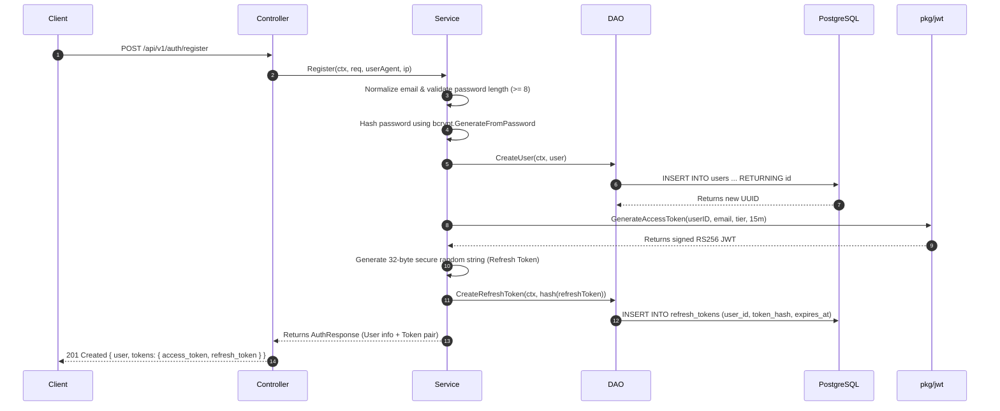
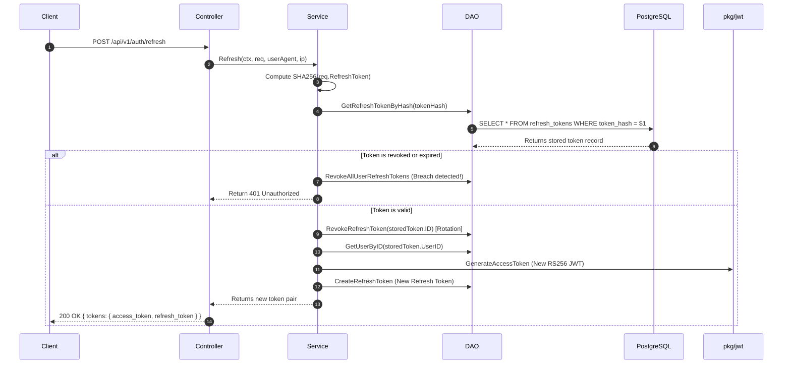
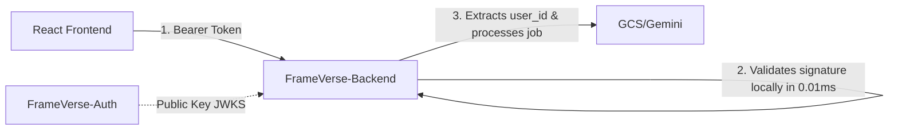

# FrameVerse-Auth — Architecture & End-to-End API Flow Guide

This document explains the internal architecture of **`FrameVerse-Auth`**, the responsibility of every package and layer, and the exact step-by-step execution path for every API endpoint.

---

# 1. Module Responsibilities & System Flow

`FrameVerse-Auth` is built using a **Clean Layered Architecture**. Code dependencies flow strictly in one direction:

```
[ HTTP Request from Browser / Client ]
                 ↓
┌─────────────────────────────────────────────────────────────┐
│ 1. Controller Layer (internal/auth/controller.go)           │
│    • Decodes JSON request body                              │
│    • Extracts Client IP & User-Agent                        │
│    • Calls Service layer & formats JSON response / error    │
└──────────────────────────────┬──────────────────────────────┘
                               ↓
┌─────────────────────────────────────────────────────────────┐
│ 2. Service Layer (internal/auth/service.go)                 │
│    • Business logic (validating email, password rules)      │
│    • Hashes passwords with bcrypt                           │
│    • Calls TokenManager (pkg/jwt) to sign RS256 JWTs        │
│    • Generates cryptographically secure refresh tokens      │
│    • Enforces Refresh Token Rotation & anti-theft checks    │
└──────────────────────────────┬──────────────────────────────┘
                               ↓
┌─────────────────────────────────────────────────────────────┐
│ 3. DAO / Data Access Layer (internal/auth/dao.go)           │
│    • Executes parameterized SQL queries                     │
│    • Maps PostgreSQL database rows to Go structs            │
└──────────────────────────────┬──────────────────────────────┘
                               ↓
┌─────────────────────────────────────────────────────────────┐
│ 4. Infrastructure & Database (pkg/postgres/db.go)           │
│    • Manages pgxpool connection pool to PostgreSQL          │
│    • Runs database schema automigrations                    │
└─────────────────────────────────────────────────────────────┘
```

### Supporting Packages & Helpers:
- **`pkg/jwt/rs256.go`:** Manages RSA-2048 key pairs. Signs 15-minute Access Tokens using **RS256 (Private Key)** and exports the **Public Key** via RFC 7517 compliant JWKS JSON.
- **`internal/middleware/auth.go`:** Intercepts requests to protected endpoints, parses `Authorization: Bearer <token>`, validates the cryptographic signature with the RSA Public Key, and attaches `user_id`, `email`, and `tier` to `r.Context()`.
- **`config/config.go`:** Loads environment variables (`DATABASE_URL`, `PORT`, token TTLs, RSA key paths) with sensible defaults.
- **`internal/server.go`:** Bootstraps and wires all layers together (DB connection, migrations, TokenManager, Controller, Chi router, CORS) and returns the configured HTTP server.

---

# 2. Step-by-Step Execution of Every API

---

### API 1: User Registration
**`POST /api/v1/auth/register`**
*Payload:* `{"email": "user@example.com", "password": "Password123!", "full_name": "Jane Doe"}`



1. **Controller:** Decodes JSON payload, captures client IP / User-Agent, and calls `service.Register()`.
2. **Service:**
   - Normalizes email (`strings.ToLower`) and validates format.
   - Hashes plaintext password with `bcrypt.DefaultCost` (cost factor 10).
3. **DAO:** Executes `INSERT INTO users` in PostgreSQL. If the email already exists, catches unique constraint violation (code `23505`) and returns `ErrUserAlreadyExists` (409 Conflict).
4. **Token Generation:**
   - Calls `pkg/jwt.GenerateAccessToken` &rarr; signs a 15-minute JWT with the **RSA Private Key**.
   - Generates a cryptographically secure 32-byte random hex string as the `refresh_token`.
   - Computes `SHA256(refresh_token)` and saves it to the `refresh_tokens` table with a 7-day expiration.
5. **Response:** Returns `201 Created` with user profile and both tokens.

---

### API 2: User Login
**`POST /api/v1/auth/login`**
*Payload:* `{"email": "user@example.com", "password": "Password123!"}`

1. **Controller:** Decodes credentials and forwards to `service.Login()`.
2. **Service & DAO:** `dao.GetUserByEmail()` queries PostgreSQL for the user row. If not found, returns `ErrInvalidCredentials` (401).
3. **Password Verification:** `bcrypt.CompareHashAndPassword()` verifies the incoming plaintext password against the stored bcrypt hash.
4. **Token Issuance:** If valid, generates a fresh 15-minute RS256 Access Token and a 7-day Refresh Token (stored hashed in PostgreSQL).
5. **Response:** Returns `200 OK` with user details and tokens.

---

### API 3: Token Refresh & Rotation (Anti-Theft Protection)
**`POST /api/v1/auth/refresh`**
*Payload:* `{"refresh_token": "raw_refresh_token_string"}`



1. **Hashing:** The service computes `SHA256(req.RefreshToken)` to look up the record in PostgreSQL.
2. **Replay Attack Detection:**
   - If the token is marked `is_revoked = true` or `time.Now() > expires_at`, the server detects that an old/stolen token is being reused.
   - It immediately revokes **all** active sessions for that user ID as a security precaution and returns `401 Unauthorized`.
3. **Token Rotation:**
   - The used refresh token is immediately marked `is_revoked = true`.
   - A brand new `access_token` and a brand new `refresh_token` are created and returned to the client.

---

### API 4: Get Current User Profile (Protected Endpoint)
**`GET /api/v1/auth/me`**
*Header:* `Authorization: Bearer <access_token>`

1. **Middleware (`AuthGuard`):**
   - Intercepts request before it hits the controller.
   - Extracts the token string from `Authorization: Bearer ...`.
   - Calls `tokenManager.ValidateAccessToken()` &rarr; checks the signature using the **RSA Public Key** and verifies expiry.
   - Injects `user_id`, `email`, and `tier` into the Go `r.Context()`.
2. **Controller & Service:** `controller.GetMe()` retrieves `user_id` from context, queries `dao.GetUserByID()`, and returns user profile (`credits`, `tier`, `email`, `created_at`).

---

### API 5: Logout
**`POST /api/v1/auth/logout`**
*Payload:* `{"refresh_token": "raw_refresh_token_string"}`

1. Computes `SHA256(req.RefreshToken)` and sets `is_revoked = true` in PostgreSQL.
2. The refresh token can never be used again.

---

### API 6: Public Key Discovery for Other Microservices
**`GET /.well-known/jwks.json`**
*No Auth Required (Public)*

*Response:*
```json
{
  "keys": [
    {
      "kty": "RSA",
      "use": "sig",
      "alg": "RS256",
      "kid": "frameverse-auth-key-1",
      "n": "u1R... (Base64URL modulus)",
      "e": "AQAB (Base64URL exponent)"
    }
  ]
}
```

---

# 3. How Other Services Use `FrameVerse-Auth` (Zero-Latency Verification)

When the user sends a request to **`FrameVerse-Backend`** (e.g. `POST /api/v1/toonify/upload-url` or connects to `vChat` over WebSockets):



1. `FrameVerse-Backend` fetches `GET /.well-known/jwks.json` once on startup (and caches the public key).
2. For every incoming user request, `FrameVerse-Backend` verifies the JWT signature locally using the public key.
3. **Benefit:** `FrameVerse-Backend` never makes a database call or HTTP network request to `FrameVerse-Auth` during user actions. Token validation is instant (microseconds).
